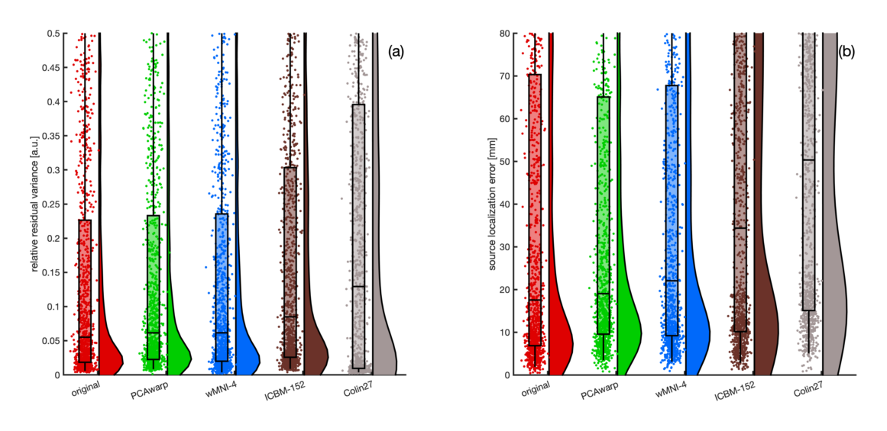

# Headmodel Individualization      
**The presented PCAwarp algorithm estimates individual head anatomies based on a large database of heads when structural MRI/CT scans are unavailable using scalp data from photogrammetry or digitized electrode positions. The final surfaces meshes can be used to construct a BEM volume conduction head model for source reconstruction with e.g. [OpenMEEG](https://openmeeg.github.io/).<br>
In our related scientific publication ["Data-driven head model individualization from digitized electrode positions or photogrammetry improves M/EEG source localization accuracy"]() (publication in progress) we demonstrate that our individualized PCAwarp head model outperformes any other head model in terms of source localization error:**
<br>
**Measured in (a) residual variance (RV) in sensor space and (b) euklidian distance in source space.** <br>
<br>
<br>


## Practitioner's Guide
This tutorial demonstrates how to perform a 3D-scan of a single subject's head and how to construct individualized surface meshes using the PCAwarp algorithm.<br>

Also check out [my related video tutorial on photogrammetry for fNIRS](https://youtu.be/upBmo2ZlWBM?t=1732) (starting at min 28:50)<br>
and the similar [tutorial on how to digitize electrodes by FieldTrip](https://www.fieldtriptoolbox.org/tutorial/electrode/).<br>
<br>


### 1. Preparing the subject
- Measure the head circumference along RPA, IN, LPA, NAS, RPA.
- Adjust downward to choose an appropriate cap size (54cm, 56cm, 58cm, 60cm).
- Attach the cap and check and correct the cap positioning using the fiducials if necessary.<br>
  (Cz should be in the middle of LPA and RPA and NAS and IN.)
- Ensure thorough cable management so that they don't protrude or overlap electrodes.
- Instruct the subject to sit still and minimize head movements.
- Equal lightning from all sides is recommended.
<br>

### 2. Setting up the scanning device
This tutorial uses an iPhone 12 mini and the app [Scaniverse](https://scaniverse.com/). However, any other hardware/software scanning solution can replace this.<br>

- Download and install the app [Scaniverse](https://scaniverse.com/) on your smartphone.

  
- At the bottom, click on '+' -> 'Mesh' -> 'Small Object'.
- Press the red recording button in the button and follow the instructions.

  
- Press the red square at the bottom to stop the recording if you are finished.
- Select 'Detail' as Processing Mode and 'Save' after the processing is finished.
- At the bottom right, click on 'Share' -> 'Export Model' -> 'OBJ' -> 'Mail' to your computer.

For details, also check [my scaniverse video tutorial (fNIRS-cap, but same procedure)](https://youtu.be/upBmo2ZlWBM?t=2020) (starting at min 33:40).<br>
<br>

### 3. During scanning
- Move the scanning device slowly around and above the subject. (Slow movements are essential to allow the software to keep track of the already scanned points. As the scanner moves, new points are added to the point cloud.)
- The ideal scanning distance is about 40cm.
- Start with less difficult regions so you’re able to capture a lot of the surface before going to more detailed regions that need more time.
- Pan and tilt the scanning device in difficult regions like at electrodes to capture everything from all angles.
- Make sure to have good quality everywhere, but at the same time, try to be quick and avoid scanning regions multiple times. Taking around 3 minutes per scan gave the best results. (If the scan lasts too long, the risk of distortion by head movements increases.)
<br>


### 4. Post-processing


If necessary, crop the obj-mesh to the EEG cap only.<br>
This is only required if more objects than the head <br>
(e.g. from the background) were accidentally scanned or/and <br>
if due to data protection the subject's face needs to be removed.<br>
This can be done easily by using [MeshLab](https://www.meshlab.net/) as shown<br>
in the right or by any other mesh manipulation software.<br>
<br>

### 5. Picking fiducials


- For example in [MeshLab](https://www.meshlab.net/), see on the right.
- Or in [cedalion](https://doc.ibs.tu-berlin.de/cedalion/doc/dev/examples/head_models/41_photogrammetric_optode_coregistration.html), automatic detection of marked the fiducials<br>
with colored stickers (manual correction possible).
- Or in [FieldTrip](https://www.fieldtriptoolbox.org/), by loading and plotting the mesh and simply <br>
clicking on the fiducials and writing the coordinates down:
  ```
  headshape = ft_read_headshape('scaniverse.obj')
  ft_plot_headshape(headshape)
  ```
<br>


### 6. Call the PCAwarp algorithm
```
# Clone the repository and install the requirements
git clone https://github.com/harmening/headmodel_individualization
cd headmodel_individualization
pip install -r requirements.txt
```
The script `PCAwarp.py` shows how to start the PCAwarp individualization algorithm. This is based on a low-dimensional representation (PCA) of head shape surface meshes trained on an equally segmented and triangulated MRI database of 316 subjects. Warping is done by finding weights for the PCs by minimizing the shape difference between electrodes / scalp proxies and fitted scalp. Exemplary call:<br>
```
python PCAwarp.py -scalp data/photogrammetry_test_data/cutscan.obj 
                  -nas   144.482786 129.291732 380.645666
                  -lpa   154.618663 59.192534 488.364463
                  -rpa   80.580458 21.190605 362.990298
```
It contains the following steps:


* Using the fiducials (NAS, LPA, RPA), transform the scalp<br>
proxy points into the [CTF-coordinate system](https://www.fieldtriptoolbox.org/faq/coordsys/), since the<br> 
database on which the PCA was applied lives in CTF space.
* Cut the input scalp proxy mesh above the ears.
* Decimate the input scalp proxy mesh to reduce the number<br>
of vertices used for computing the shape difference.
* PCA warping, parameters are: number of PCs used for <br>
reconstruction, regularizer type (if meshes are intersecting).
* Transform back from CTF in original input space.
* Save surface meshes.

**Supported input file formats (scalp proxy):**
* Any [trimesh](https://trimesh.org/) supported mesh format like .stl, .obj, .ply, ....
* [BrainVision CapTrak](https://www.brainproducts.com/solutions/captrak/) files (.bvct).
* [Polhemus Fastrak](https://polhemus.com/scanning-digitizing/digitizing-products/) files (.hsp, .elp, .eeg).
* [Polaris Vicra](https://www.ndigital.com/optical-navigation-technology/polaris-vicra/) files(.elc).
* numpy array (.npy) containing (n x 3) coordinates of the scalp proxy points.
* simple .txt containing (n x 3) coordinates of the scalp proxy points.

**Supported output file formats (surface meshes):**
* .tri for [OpenMEEG](https://openmeeg.github.io/).
* .mat for [Matlab](https://de.mathworks.com/products/matlab.html) / [FieldTrip](https://www.fieldtriptoolbox.org/).
* .surf for [MNE-python](https://mne.tools/stable/index.html).
* .npy as simple dictionary containing the 4 output meshes.

**Need more support/interfaces? Please contact me or open an issue on GitHub.**<br>


<!--- 
## Citing
If you find the headmodel individualization useful for your research, please consider citing our related [paper]().
```
@article{Harmening_2024,
      author  = {Harmening, Nils and
                 von Lühmann, Alexander and
                 Blankertz, Benjamin}
      title   = {Data-driven head model individualization from digitized electrode positions or photogrammetry improves M/EEG source localization accuracy}
      year    = {2024},
      journal = {Nice Journal}
      doi     = {},
      volume  = {},
      number  = {},
      pages   = {},
}
```
--->


